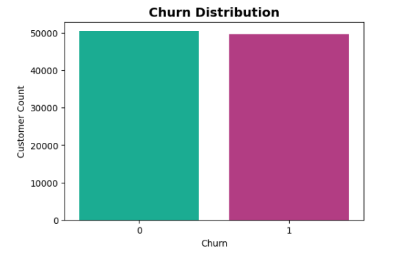
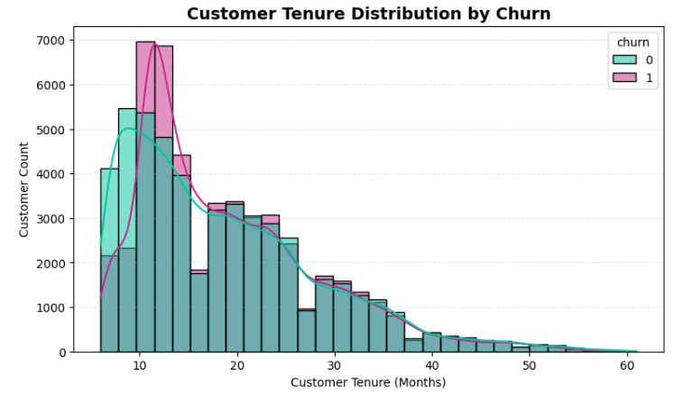
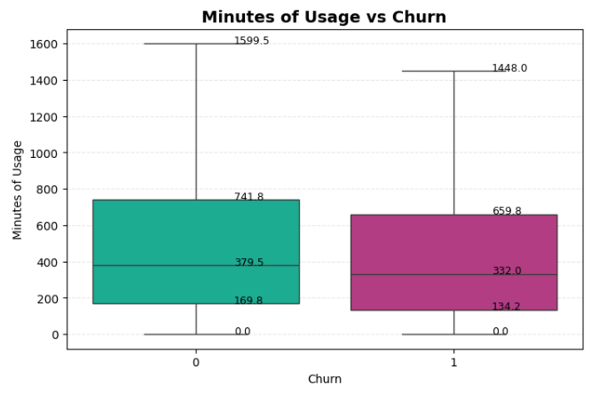
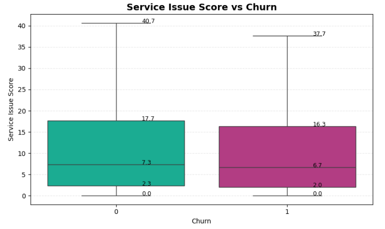
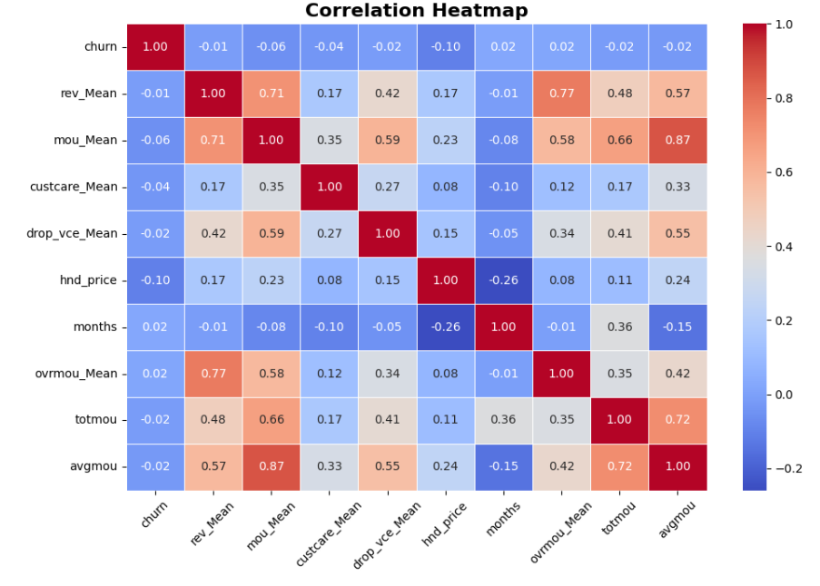
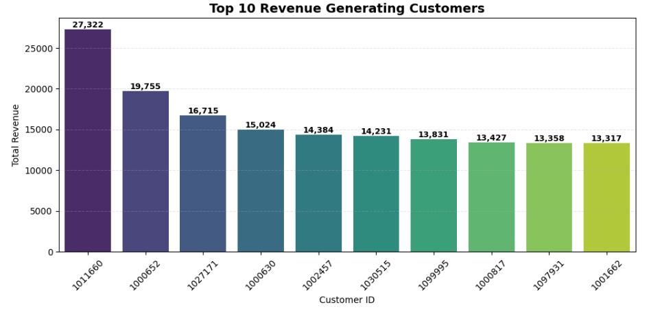
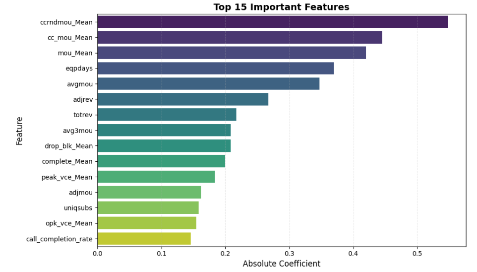
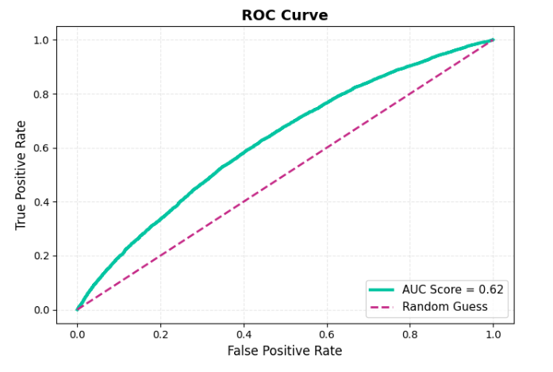

# 📞 Customer Churn Prediction System

## 📌 Project Overview

This project builds a complete Machine Learning pipeline to predict telecom customer churn using customer behavior, revenue patterns, service interaction, usage activity, and device information.

The goal is to identify high-risk customers before they leave so the company can improve customer retention strategies.

---

---

# 🎯 Project Objective

- Predict whether a customer will churn or stay
- Analyze customer behavior patterns
- Identify major churn-driving factors
- Generate business insights using Machine Learning

---

# 🛠️ Technologies Used

## 📚 Libraries

- pandas
- numpy
- matplotlib
- seaborn
- scikit-learn

---

# 📂 Dataset Information

The dataset contains information about **100,000 telecom customers** including:

- Customer usage behavior
- Revenue details
- Customer care interaction
- Device information
- Demographic data
- Churn status

### 🎯 Target Variable

| Value | Meaning |
|---|---|
| 1 | Customer Left |
| 0 | Customer Stayed |

---

## 🔄 Project Workflow

**Raw Telecom Dataset → Data Cleaning → EDA → Feature Engineering → Machine Learning → Model Evaluation → Business Insights**

---

# 🧹 Data Cleaning

- Missing value handling
- Duplicate check
- Data type validation
- Category standardization

---

# 📊 Exploratory Data Analysis

The project includes analysis on:

- Churn Distribution
- Revenue vs Churn
- Usage vs Churn
- Tenure Analysis
- Customer Care Interaction
- Device Analysis
- Revenue Distribution
- Correlation Heatmap

---

# 📷 Project images

## 📌 Churn Distribution

## 📌 Customer Tenure Distribution by Churn

## 📌 Minutes of Usage vs Churn

## 📌 Service Issue Score vs Churn

## 📌 Correlation Heatmap

## 📌 Top 10 Revenue Generating Customers

## 📌 Top 15 Important Features

## 📌 ROC Curve

---

# ⚙️ Feature Engineering

Created custom business-focused features such as:

- Revenue Segment
- Usage Segment
- Tenure Group
- Device Age Group
- Service Issue Score
- Customer Value Score
- Customer Engagement Score
- Revenue Per Month
- Call Completion Rate
- High Risk Customer Flag

---

# 🤖 Machine Learning Model

## Model Used
- Logistic Regression

## Preprocessing Steps

- One-Hot Encoding
- Train-Test Split
- Feature Scaling

---

# 📈 Model Performance

| Metric | Score |
|---|---|
| Accuracy | 59% |
| Precision | 58.77% |
| Recall | 58.50% |
| F1 Score | 58.63% |
| ROC-AUC Score | 0.62 |

---

# 🔥 Key Business Insights

- New customers churn the most
- Low usage strongly indicates churn risk
- Silent customers are more dangerous than complaining customers
- Revenue alone cannot predict churn
- High-value customers contribute major revenue
- Churn is driven by multiple factors together

---

# 👨‍💻 About Me

## Sayan Naha

📧 **Email:** snsayan2012@gmail.com  
🔗 **LinkedIn:** [Sayan Naha](https://www.linkedin.com/in/sayan-naha/)
